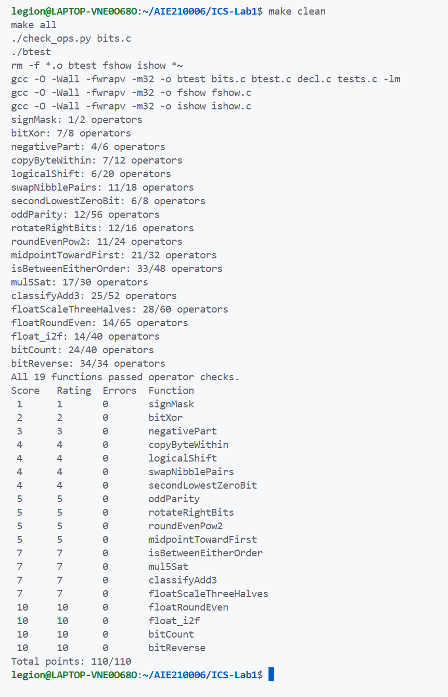

# Lab1：DataLab 实验报告

## 测试结果

已有截图包含 `./check_ops.py bits.c` 和 `./btest` 的输出：19 个函数均通过运算符检查，各题 `Errors` 为 0，总分为 `110/110`。

## 实现思路

1. **P1 `signMask`**：将 1 左移 31 位，得到仅最高位为 1 的掩码。
2. **P2 `bitXor`**：分别排除两位都为 1、两位都为 0 的情况，再按位与，得到异或结果。
3. **P3 `negativePart`**：算术右移 31 位取得全 0 或全 1 的符号掩码，与补码取负结果按位与。
4. **P4 `copyByteWithin`**：把字节编号转换为移位量，用 `0xff` 提取源字节，清空目标字节后写入。
5. **P5 `logicalShift`**：参考P1，构造低 `32−n` 位为 1 的掩码，清除算术右移补入的符号位。
6. **P6 `swapNibblePairs`**：参考P4，将掩码扩展为四组 `00001111`，分别移动各字节的高、低半字节后合并。
7. **P7 `secondLowestZeroBit`**：先用 `(x+1)|x` 填上最低的 0，再利用加一产生的变化和异或，提取下一个 0 的位置。
8. **P8 `oddParity`**：依次与右移 16、8、4、2、1 位的值异或，将奇偶性折叠到最低位；对最低位逻辑取反，得到奇校验位。
9. **P9 `rotateRightBits`**：先用 `n&31` 将移位量归一化。参考P5取得逻辑右移部分，用两次左移补回绕出的高位，再按位或合并。
10. **P10 `roundEvenPow2`**：设半程为 `2^(n−1)`，按商的最低位构造偏置“半程减一加奇偶位”，加偏置后清零低 n 位，实现中点取偶数。
11. **P11 `midpointTowardFirst`**：先分别右移 x、y 再相加，避免直接求和溢出。参考P3提取符号：异号看符号，同号看 `y−x` 的符号；结合两数最低位补上修正量，使半整数中点靠近 x。
12. **P12 `isBetweenEitherOrder`**：参考P11的有符号比较，分别判断 `x≥a`、`x≥b`；两结果不同或 x 等于任一端点时，属于闭区间。
13. **P13 `mul5Sat`**：依次计算 2x、4x、5x，通过与 x 的符号差异检测溢出。参考P3，用掩码选择正常结果或按 x 符号确定的饱和值。
14. **P14 `classifyAdd3`**：参考P13的符号变化检测，对两次加法分别记录正溢出 `+1`、负溢出 `−1`，累加得到最终分类，反向溢出可以抵消。
15. **P15 `floatScaleThreeHalves`**：拆出符号、阶码和尾数，特殊值原样返回。非规格化数直接计算尾数的三倍再除二；规格化数补隐含位后乘三，根据大小右移一位或两位并调整阶码。舍入参考P10，以保留位的奇偶性处理中点。
16. **P16 `floatRoundEven`**：参考P15拆分浮点字段，按指数判断数值范围：已是整数或特殊值直接返回，小数值返回带符号的零或一；其余情况定位小数位，参考P10决定进位，再清除小数位。
17. **P17 `float_i2f`**：用无符号数保存绝对值，左移至最高位为 1，并同步调整阶码。参考P16，根据丢弃的低 8 位和保留位的奇偶性决定舍入；有效尾数进位时增加阶码，再拼接结果。
18. **P18 `bitCount`**：参考P6构造重复掩码，按 2、4、8 位分组累加 1 的数量，再合并各字节计数，取低 6 位得到总数。
19. **P19 `bitReverse`**：参考P18的分组掩码，依次交换相邻的 1、2、4、8、16 位块。用前一层掩码与其移位结果异或构造下一层，减少操作数。

## 参考资料与 AI 辅助

- ChatGPT 辅助理解题意、讨论算法并参考部分实现，尤其是浮点部分；
